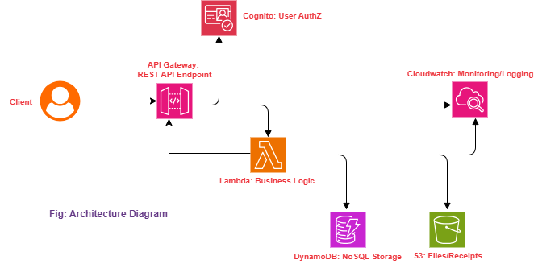

# Architecture Overview

## High-Level Diagram

*Place the diagram image `architecture.png` in the same folder as this file or update the path accordingly.*

---

## System Summary

This document describes the architecture of a scalable, secure AWS serverless expense tracker application built with best practices.

- Authentication is handled by **AWS Cognito** for user management and secure access.
- API requests from clients go through **API Gateway**, which routes to backend compute.
- **AWS Lambda** functions in Python execute business logic such as expense CRUD and receipt processing.
- Data is stored in **Amazon DynamoDB**, a highly available NoSQL database.
- Receipts and other files are stored securely in **Amazon S3**.
- Complex workflows like expense approval are modeled and managed using **AWS Step Functions**.
- Monitoring and logging are managed through **Amazon CloudWatch** (not shown in diagram).

---

## Key Components

| Component       | Purpose                                       |
|-----------------|-----------------------------------------------|
| Cognito         | User authentication and authorization         |
| API Gateway     | Exposes RESTful API endpoints                  |
| Lambda          | Executes business logic in a serverless setup |
| DynamoDB        | Stores expense and user data                    |
| S3              | Holds receipt images and uploaded documents    |
| Step Functions  | Orchestrates expense approval workflows        |

---

## Architectural Flow

1. User logs in/signs up via Cognito.
2. Client apps call API Gateway endpoints.
3. API Gateway authorizes requests using Cognito tokens.
4. Lambda functions process requests and interact with DynamoDB and S3.
5. Step Functions manage multi-step workflows like approvals.
6. CloudWatch collects logs and metrics for observability.

---

## Next Steps

- Add this diagram and architecture documentation to the project repository.
- Implement component integration based on this architecture.
- Define IAM roles and security policies following the principle of least privilege.
- Setup CI/CD pipelines for automated deployments.
- Develop unit and integration tests to ensure reliability.

---

This architecture provides a robust, cost-effective foundation for building and scaling your AWS serverless expense tracker application.

---

Feel free to request additional documentation sections or further simplifications as needed.
